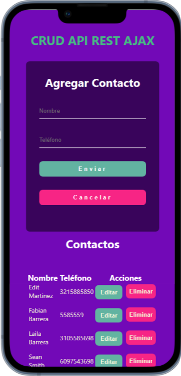

# crud-Ajax
*API_REST_CRUD-Ajax - Agenda de contactos responsivo utilizando Ajax, JavaScript, Node,Js, servidor JSON Server, archivo tipo JSON como base de datos para persistir los cambios en el tiempo.

# Getting started
 * Install nodeJs
 * Install JSON Server

 * npm install -g json-server

# Start JSON Server

 * json-server --watch db.json
# Resources
 *  Home
 * http://localhost:3000
 * http://localhost:3000/agendaEmpresa / this is the db for use.
 * http://localhost:3000/proveedores
 * more information visit https://github.com/typicode/json-server
 
# Important note
 * In local environments you must emulate a web server (like live server).

